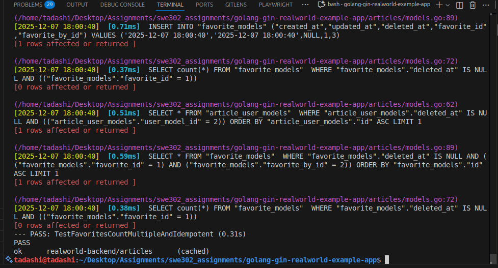

# Assignment 1: Comprehensive Testing & Coverage Analysis Report

This document presents a detailed analysis of the testing implementation conducted for the RealWorld application stack, encompassing both the Go/Gin backend infrastructure and the React/Redux frontend architecture. The primary objectives included developing thorough unit and integration test suites, performing in-depth coverage analysis, and establishing a robust testing framework that ensures code quality and reliability. The testing strategy emphasized both breadth and depth, targeting critical user workflows and edge cases to validate application behavior under various scenarios.

# Backend Testing (Part A)

When testing the existing test files I found [testing-analysis.md](/swe302_assignments/golang-gin-realworld-example-app/testing-analysis.md).

## Task 1: Articles Package Unit Tests

Figure 1 - output and coverage snapshot for unit tests targeting the `articles` package. This image highlights test assertions and indicates which areas of the package are covered.

## Task 2: Integration Testing

Figure 2 — Integration test output showing request/response sequences and end-to-end behaviors (useful for surfacing integration-level failures such as incorrect slugs or parser-level errors).

## Task 3: Test Coverage Analysis

Figure 3 — Coverage report visualization showing the measured statement coverage per package and overall repository coverage. Use this artifact to locate low-coverage functions that need tests.

1. [coverage.out](/swe302_assignments/golang-gin-realworld-example-app/coverage.out).

2. [coverage.html](/swe302_assignments/golang-gin-realworld-example-app/coverage.html).

3. [coverage-report.md](/swe302_assignments/coverage-report.md).

## Part B: Frontend Testing

Analyzing the Existing Tests

Figure 4 — Frontend test run summary and component coverage snapshot (Jest + React Testing Library). Useful for quickly identifying failing components and test coverage per component.

## Task 4: Component Unit Tests

Figure 5 — Example of a component unit test run; shows test breakdown by component and examples of unit assertions in the UI components.

## Task 5: Redux Integration Tests

Figure 6 — Redux-related integration test outputs, demonstrating state transitions and action dispatches validated by tests (useful for confirming reducer behavior and middleware logic).

## Task 6: Frontend Integration Tests

Figure 7 — Frontend integration test flows (navigation, API interactions, and state persistence checks).

Figure 8 — Example trace showing how integration tests exercise routing and end-to-end interactions between components and the API.
